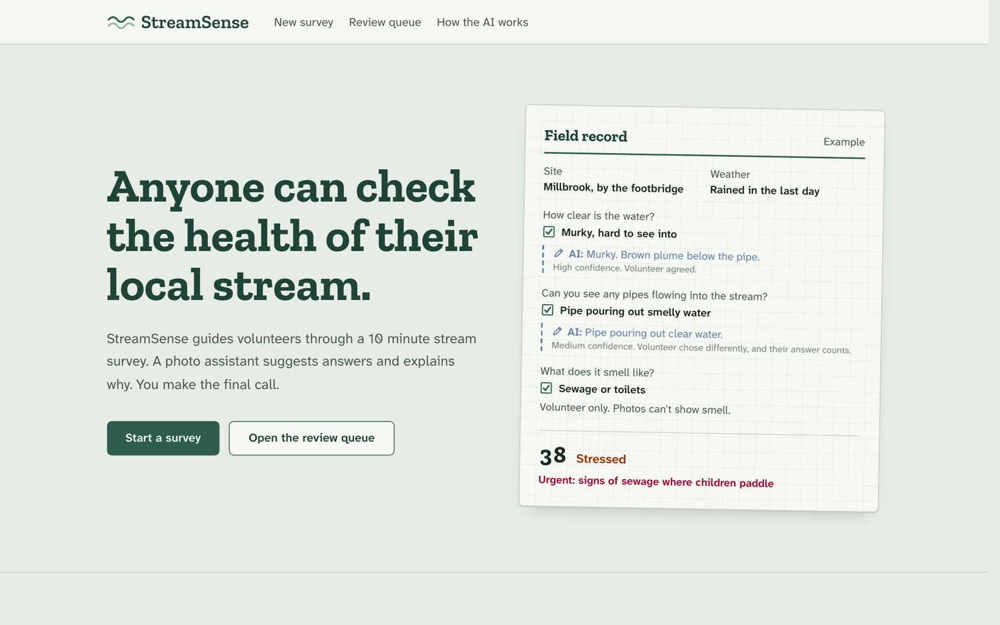
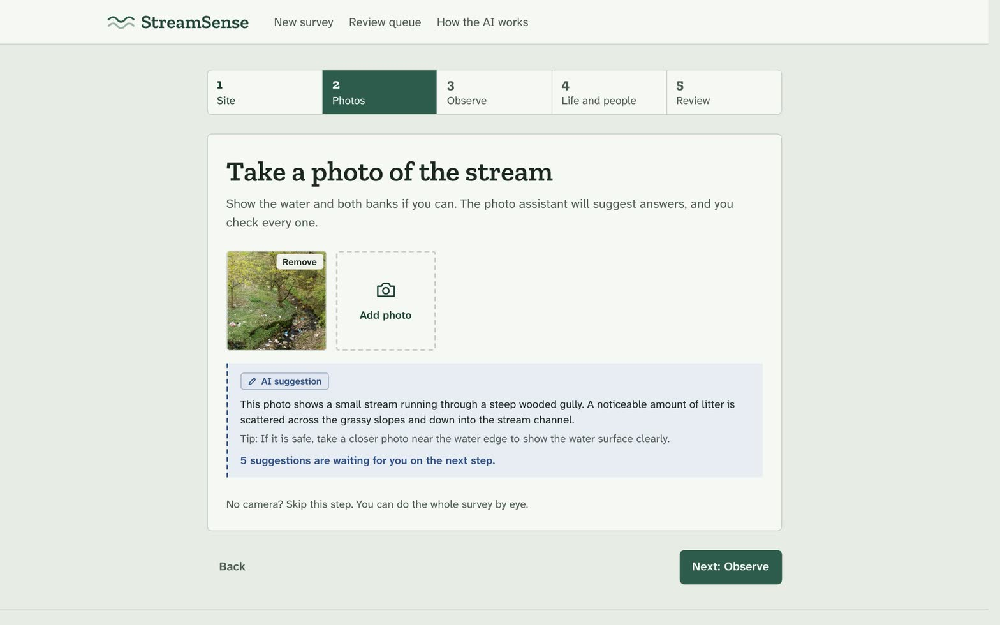
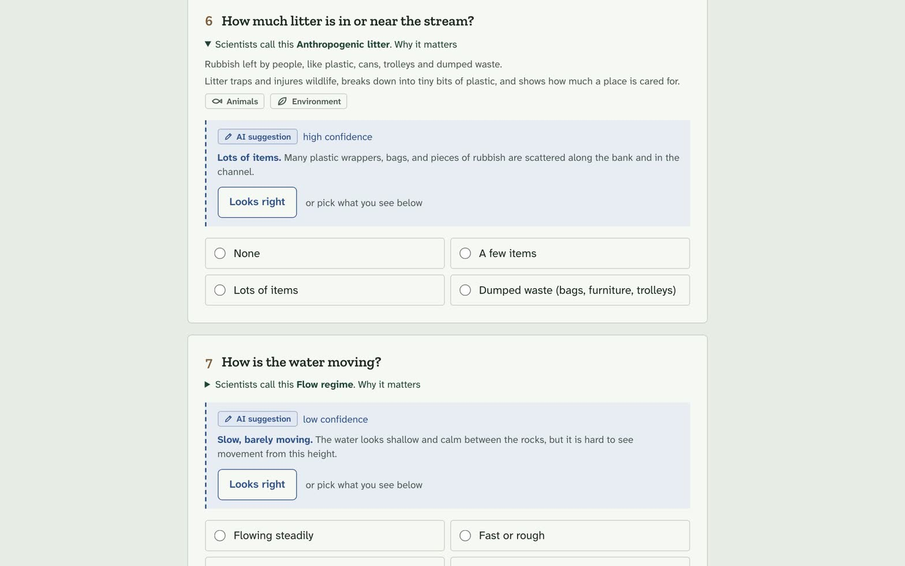
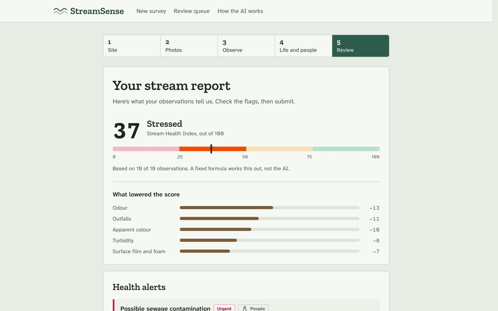
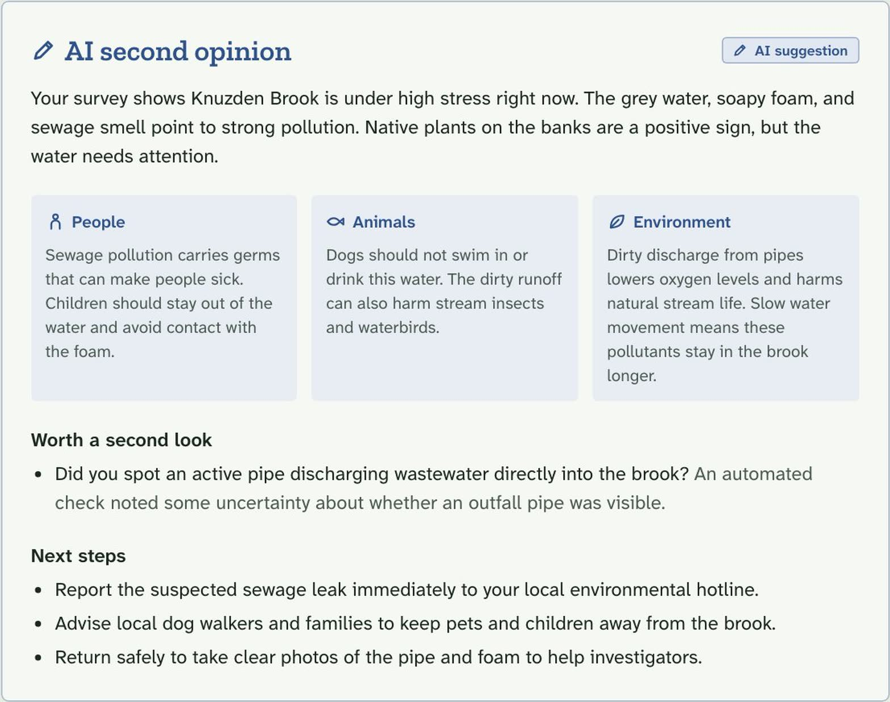
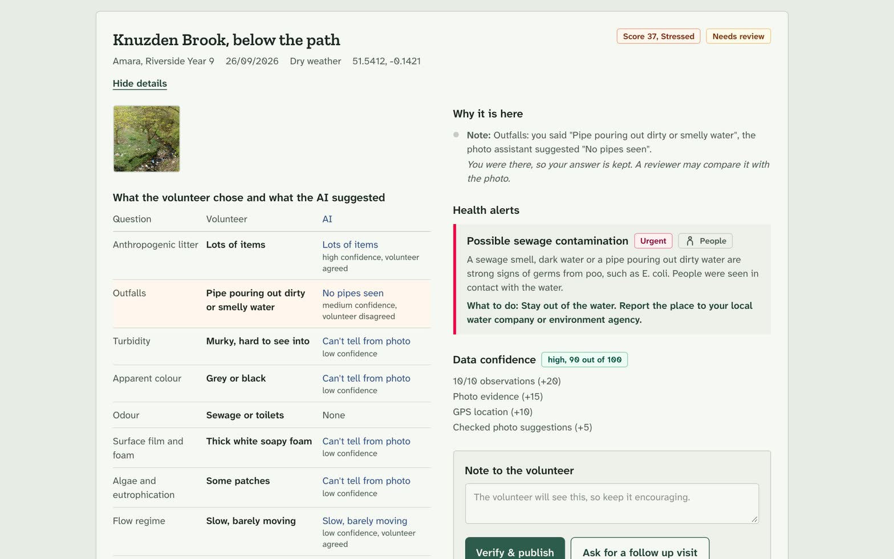
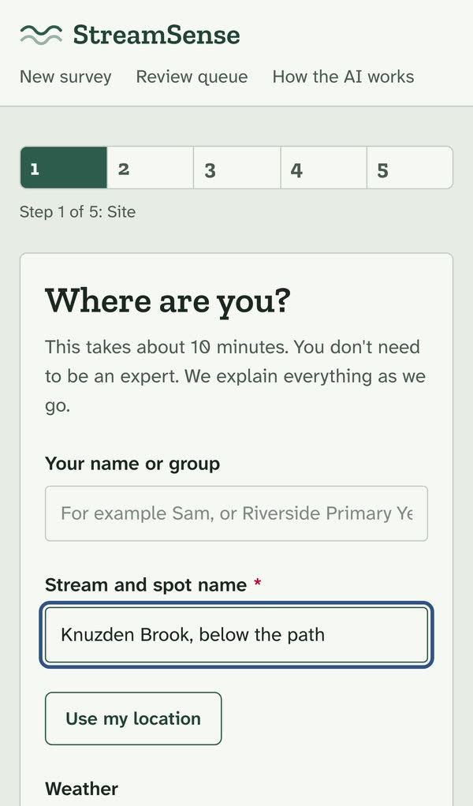

# StreamSense

**Check the health of a stream with help from AI. The AI suggests. People decide.**

StreamSense helps anyone check the health of a city stream in about 10 minutes. You answer simple questions and add a photo. The AI looks at the photo and suggests answers. It shows how sure it is and what it saw. You accept or change each answer. The app then gives the stream a health score and warns about risks to people, animals and nature. Unusual reports go to a human expert before they are published.

**Live: [streamsense-vert.vercel.app](https://streamsense-vert.vercel.app)**

## Demo

https://github.com/user-attachments/assets/f8832ce3-661e-4c68-a96a-b27649c83618

## The problem

City streams suffer from sewage, dirty runoff, litter and loss of wildlife. Volunteers can watch far more streams than experts can, but their data is often seen as unreliable. Volunteers rarely get feedback, and science words can put new people off. The links between stream health and the health of people and pets (for example, toxic algae and dogs, or sewage and children playing in the water) are rarely made clear.

## How StreamSense helps

1. **Guided survey.** 10 simple questions. Each one shows the science word behind it and why it matters.
2. **Photo assistant.** The AI looks at your photo and suggests answers. It says "can't tell" instead of guessing.

3. **Health score.** A fixed, published formula works out the score, not the AI.
4. **Health alerts.** Simple rules link what you saw to risks for people, animals and nature.
5. **Data checks.** If answers look odd or clash, the app asks you to double check.

6. **AI second opinion.** A short summary in plain English with next steps.

7. **Expert review.** Flagged reports go to a reviewer before they are published.

## Who it is for

* **Volunteers:** local people, schools, fishing clubs and river groups.
* **Reviewers:** coordinators and ecologists who check unusual reports.
* **Decision makers:** environment and public health teams who need data they can trust.

## Credits

The stream photo in the demo and screenshots is "Knuzden Brook" by Mr T ([geograph.org.uk](https://www.geograph.org.uk/photo/425059)), licensed [CC BY-SA 2.0](https://creativecommons.org/licenses/by-sa/2.0).

## License

MIT
